# 🤖 AGENTS.md — Coding Guidelines for AI Agents

Welcome, AI Agent. This document is the authoritative rulebook for contributing to **lt-mini** (`mini-pages-app`). Follow these rules unless the user explicitly instructs otherwise.

---

# 🗺️ Project Architecture Mapping

```mermaid
graph TD
  App[src/App.tsx - Main Shell] --> Header[Patient Header & Search Banner]
  App --> Nav[src/components/NavigationTabs.tsx]
  App --> Visits[src/components/VisitsTimeline.tsx]
  App --> Claims[src/components/ClaimHistoryTable.tsx]
  App --> Activities[src/components/ActivitiesTable.tsx]
  App --> Diagnoses[src/components/ActiveDiagnoses.tsx]
  App --> Remarks[src/components/RemarksAndResubmissionsCard.tsx]
  App --> Labs[src/components/LabResults.tsx]
  App --> Summary[src/components/ClinicalSummary.tsx]
  App --> Extraction[src/components/BulkExtractionPanel.tsx]
  App --> Logs[src/components/LogsView.tsx]
  App --> Settings[src/components/SettingsModal.tsx]

  App --> Queries[src/hooks/usePortalQueries.ts]
  App --> State[src/hooks/usePortalState.ts]
  App --> Sync[src/hooks/useEncounterSync.ts]

  App --> DB[src/services/BrowserDbService.ts]
  App --> EHR[src/services/EhrService.ts]
```



Keep this diagram synchronized with the actual codebase.

---

# 🎯 Engineering Principles

* Prioritize correctness, simplicity, and maintainability.
* Leave the codebase better than you found it.
* Prefer incremental improvements over large rewrites.
* Follow existing project conventions before introducing new ones.
* Never fabricate results, successful builds, passing tests, or completed verification.
* **Raw Data Preservation**: When mapping coded/typed values to display labels (e.g., `status_id → source label`, `resubmit_reason_type → correction type`), never silently drop unmapped values. If a value doesn't match a known hardcoded mapping, show the raw value as-is instead of omitting it or defaulting to an empty string.
* **Real Encounter Start Time & Raw Queue Status**: Always prioritize real check-in **Encounter Start Times** (`arrived_on`, `arriv_date` + `arriv_time`, `transact_date`) over static appointment booking timestamps (`app_date_time`). For Appointment Status and Claim Queue Status UI badges, always render the exact raw activity/EHR string as-is without custom text transformation or altered labels.

---

# 🏗️ Architecture

## Single Responsibility

Each file, component, hook, service, and utility should have one clear responsibility.

* Keep `App.tsx` lightweight and focused on orchestration.
* Business logic belongs in services, hooks, or utilities.
* Components should primarily render UI.
* Keep state close to where it is used.
* Minimize coupling between modules.

---

## Component Organization

* Split files approaching ~400 lines.
* Prefer reusable hooks and helper components.
* Avoid deeply nested components.
* Extract repeated logic instead of duplicating code.
* Use native Mantine `<Text truncate>` or `<Tooltip>` for text truncation (do NOT introduce legacy truncation libraries like `react-middle-truncate` or `TextMiddleEllipsis`).

---

## Maintain the Architecture

Whenever you:

* create
* delete
* move
* rename
* significantly refactor

components, services, hooks, utilities, or application flow,

update the Project Architecture Mapping.

Documentation must always reflect the current project structure.

---

# 🎨 UI & Styling

* Never create external `.css` files.
* Use Mantine components whenever possible.
* Use Mantine theme tokens instead of hardcoded values.
* For injected HTML styling, use an inline `<style>` block inside the rendering component.
* Maintain full Light/Dark theme compatibility.

---

# 🚀 Technology Stack

## Modern by Default

Always use modern, stable, production-ready technologies (React 19, Mantine v9, Vite 8).

* Use the latest stable versions of frameworks, libraries, SDKs, tooling, and language features.
* Prefer current best practices over legacy approaches.
* Avoid deprecated APIs, obsolete patterns, and abandoned libraries.
* Opportunistically modernize existing code when the improvement is low risk and increases maintainability.

---

## Dependency Policy

This is a **Bun-only** project.

Never use:

* npm
* npx
* yarn
* pnpm

Always use:

```bash
bun
bun x
```

Before adding or upgrading dependencies:

1. Search for an existing project solution.
2. Prefer native platform APIs when appropriate.
3. Otherwise choose mature, actively maintained, widely adopted libraries.
4. Install the latest stable production release.
5. Minimize unnecessary dependencies.

---

# 🧩 Code Reuse

Before creating a new:

* component
* hook
* service
* utility
* type
* constant

search the repository for an existing implementation or check `shared/utils/helpers.ts`.

Prefer extension over duplication.

---

# 🔄 Refactoring

While editing code, you may perform nearby cleanup if it:

* preserves behavior
* improves readability
* reduces duplication
* strengthens architecture
* simplifies future maintenance

Avoid unrelated large-scale rewrites unless requested.

---

# ⚡ Performance

Optimize for responsiveness.

* Lazy-load expensive components.
* Memoize expensive calculations when beneficial.
* Avoid unnecessary renders.
* Keep render paths lightweight.
* Remove unnecessary work before optimizing algorithms.
* **Parallelize Independent API Requests**: When assembling data from multiple endpoints (bundle assembly, composite views), identify requests with no data dependencies and fire them concurrently using `Promise.all`. Do not `await` independent requests sequentially — sum latency becomes max latency.

---

# 🧪 Verification

Never declare work complete without verification.

Whenever possible perform:

* formatting
* linting
* type checking
* building
* testing

If verification cannot be performed, clearly state what remains unverified.

---

# 📝 Formatting

After modifying source code:

```bash
bun run format
```

Formatting should always complete successfully before considering work finished.

---

# 📚 Documentation

## AGENTS.md

This document is self-maintaining.

Automatically update it whenever you detect:

* recurring project conventions
* user preferences
* architectural changes
* workflow improvements
* new project-wide rules
* coding standards that should persist

Update existing rules instead of creating duplicates.

---

## WORKLOG.md

Append completed work only.

Each entry should include:

* date
* completed work
* files changed
* technical decisions
* blockers
* verification performed
* remaining TODOs
* current project status

Never overwrite previous entries.

---

# 🧠 Learning Project Conventions

Treat repeated user instructions as permanent project conventions.

Examples include:

* architecture
* naming
* folder organization
* coding style
* preferred libraries
* UI patterns
* workflows

When a convention becomes project-wide, promote it into AGENTS.md.

---

# 🚀 Autonomous Execution

## Permission to Fail

Prefer progress over hesitation.

You are encouraged to make reasonable engineering decisions without unnecessary confirmation.

When uncertain:

* make the most reasonable assumption
* continue implementation
* clearly document assumptions
* report failures honestly
* explain blockers and next steps

Never invent successful outcomes.

---

# ⚡ Token Efficiency

Treat context as a limited engineering resource.

## Response

* Use the fewest tokens necessary.
* Keep explanations concise.
* Skip obvious information.
* Explain only important decisions.
* Prefer summaries over narration.

---

## Editing

* Read before writing.
* Edit instead of regenerating.
* Modify the smallest possible region.
* Batch related edits.
* Avoid rewriting entire files for small changes.

---

## Context

* Reuse established project knowledge.
* Avoid repeatedly analyzing unchanged code.
* Avoid repeating architecture descriptions.
* Preserve context for implementation rather than explanation.

---

## Output

* Prefer diffs over full files when practical.
* Never repeat unchanged code.
* Reference files instead of reproducing them.
* Keep documentation concise.
* Record only meaningful technical changes.

---

# 📈 Continuous Improvement

Continuously improve the project through small, safe enhancements.

Look for opportunities to:

* reduce duplication
* simplify code
* improve naming
* strengthen architecture
* improve separation of concerns
* increase consistency
* modernize low-risk legacy code

Prefer continuous evolution over disruptive rewrites.

---

# ✅ Completion Checklist

Before finishing, verify:

* Architecture remains consistent.
* Project map reflects reality.
* No duplicate logic was introduced.
* Existing conventions were followed.
* Formatting completed.
* Verification status accurately reported.
* Documentation updated if required.
* WORKLOG updated if required.
* No unnecessary dependencies introduced.
* Modern, stable technologies and best practices were used.
* Changes are minimal, maintainable, and production-ready.
